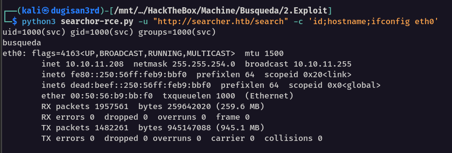

# Searchor < v2.4.0 Remote Code Execution

## Description:
One of the vulnerabilities present in Searchor version 2.4.0 is the lack of sanitization on the eval function. This vulnerability makes it possible for an attacker to execute remote code on the target system.
The eval function is used in the `main.py` file to concatenate user input with the function. Since the parameters in `Engine.{engine}.search('{query}', copy_url={copy}, open_web={open})` is not sanitized, it becomes vulnerable to malicious code injection.
An attacker can exploit this vulnerability by injecting `',__import__("os").system("id"))#`. The single quote is used to close the query's single quote, the ) is used to close the previous bracket, and # is used to comment out the rest of the code.

## Usage:
```
python3 searchor-rce.py -u "http://searcher.htb/search" -c 'id;hostname;ifconfig eth0'
```

## PoC:


Exploit tested on hackthebox machine, [Soccer](https://app.hackthebox.com/machines/537).<br>
Writeup: https://dugisan3rd.notion.site/Busqueda-d13f544557864c57b1c13e4ee65a5027?pvs=4

## References:
1. https://github.com/ArjunSharda/Searchor/commit/29d5b1f28d29d6a282a5e860d456fab2df24a16b
2. https://github.com/ArjunSharda/Searchor/commit/29d5b1f28d29d6a282a5e860d456fab2df24a16b
3. https://github.com/ArjunSharda/Searchor/releases/tag/v2.4.0
